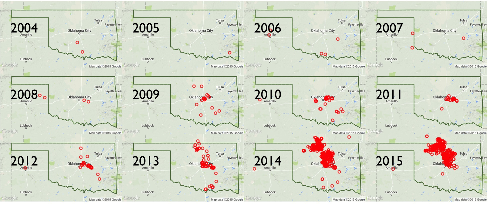
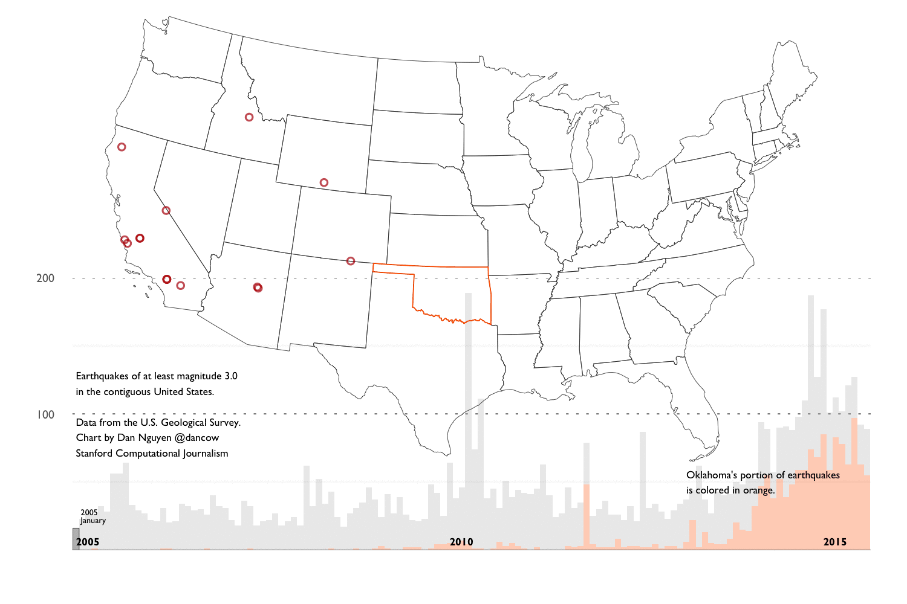

__Quick summary__: This is a four-part walkthrough on how to collect, clean, analyze, and visualize earthquake data. While there is a lot of R code and charts, that's just a result of me wanting to practice ggplot2. The main focus of this guide is to practice purposeful research and numerical reasoning as a data journalist.

__Quick nav__:

- The [chapter summaries](#chapter-summaries) 
- The [full table of contents](#full-toc).
- [The repo containing the notebooks, code, and data](https://github.com/dannguyen/ok-earthquakes-RNotebook)
- [The repo in a zip file](https://github.com/dannguyen/ok-earthquakes-RNotebook/archive/master.zip).

The main findings of this walkthrough summed up in an animated GIF composed of charts created with ggplot2:

__The four chapters:__

0. [Meta stuff](#mark-chapter-0) - A summary of what this walkthrough contains, the ideal intended audience, and technical details on how to configure your system and R setup similar to mine.
1. [Background into Oklahoma's earthquakes](#mark-chapter-1) - An overview of the scientific and political debates after Oklahoma's earthquake activity reached a record high -- in number and in magnitude -- since 2010. And an overview of the main datasets we'll use for our analysis.
2. [Basic R and ggplot2 concepts and examples](#mark-chapter-2) - In this chapter, we'll cover most of the basic R and ggplot2 conventions needed to do the necessary data-gathering/cleaning and visualizations in subsequent chapters.
3. [Exploring the historical earthquake data since 1995](#mark-chapter-3) - We repeat the same techniques in chapter 2, except instead of one month's worth of earthquakes, we look at 20 years of earthquake data. The volume and scope of data requires different approaches in visualization and analysis.
4. [The Data Cleaning](#mark-chapter-4) - By far the most soul-suckingly tedious and frustrating yet most necessary chapter in every data journalism project.

### Key charts

__Full table of contents__

* TOC
{:toc}

# Chapter 0: Meta stuff

## Long summary of this walkthrough

This extremely verbose writeup consists of a series of R notebooks and aggregation of [journalism and research into the recent "swarm" of earthquake activity in Oklahoma](https://stateimpact.npr.org/oklahoma/tag/earthquakes/). It is now (and by "now", I mean [very recently](http://earthquakes.ok.gov/news/)) generally accepted by academia, industry, and the politicians, that the earthquakes are the result of drilling operations. So this walkthrough won't reveal anything new to those who have been following the news. But I created the walkthrough to provide a layperson's guide of how to go about researching the issue and also, how to create reproducible data process, including how to collect, clean, analyze, and visualize the earthquake data.

These techniques and principles are general enough to apply to any investigative data process. I use the earthquake data as an example because it is about as clean and straightforward as datasets come. However, we'll find soon enough that it contains the same caveats and complexities that are inherent to all real-world datasets.

__Spoiler alert.__ Let's be clear: 20 years of earthquake data is not remotely enough for amateurs nor scientists to make sweeping conclusions about the source of recent earthquake activity. So I've devoted a good part of [Chapter 4](#mark-chapter-4) to explaining the limitations of the data (and my knowledge) and pointing to resources that you can pursue on your own.

## Intended audience

## About the code

I explain as much of the syntax as I can in [Chapter 2](#mark-chapter-2), but it won't make sense if you don't have _some_ experience with ggplot2. The easiest way to follow along is clone the Github repo here:

[https://github.com/dannguyen/ok-earthquakes-RNotebook](https://github.com/dannguyen/ok-earthquakes-RNotebook)

Or, [download it from Github as a zip archive](https://github.com/dannguyen/ok-earthquakes-RNotebook/archive/master.zip). The [__data/__](https://github.com/dannguyen/ok-earthquakes-RNotebook/tree/master/data) directory contains mirrors of the data files used in each of the notebooks.

The code I've written is at a beginner's level of R (i.e. where I'm at), with a heavy reliance on the [ggplot2 visualization library](http://ggplot2.org/), plus some Python and Bash where I didn't have the patience to figure out the R equivalents. If you understand how to work with data frames and have some familiarity with ggplot2, you should be able to follow along. Rather than organize and modularize my code, I've written it in an explicit, repetitive way, so it's easier to see how to iteratively build and modify the visualizations. The drawback is that there's the amount of code is more intimidating.

My recommendation is to __not__ learn ggplot2 as I initially did: by copying and pasting ggplot2 snippets without understanding the theory of ggplot2's "grammar of graphics." Instead, read ggplot2 creator Hadley Wickham's book: [ggplot2: Elegant Graphics for Data Analysis](http://www.amazon.com/ggplot2-Elegant-Graphics-Data-Analysis/dp/0387981403). While the book seems stuffy and intimidating, it is by far the best way to get up to speed on ggplot2, both because of ggplot2's nuanced underpinnings and Wickham's excellent writing style. You can buy the [slightly outdated (but still worthwhile) 2009 version](http://www.amazon.com/ggplot2-Elegant-Graphics-Data-Analysis/dp/0387981403) or attempt to build [the new edition that Wickham is currently working on](https://github.com/hadley/ggplot2-book).

## X things you might learn how to do in R

Most of these things I learned during the process of writing this walkthrough:

- How to make a scatterplot
- [How to reduce the effect of overplotting](#how-reduce-overplotting)
- [How to make a histogram](#how-histogram)
- How to customize the granularity of your histogram
- How to create a two-tone stacked chart
- How to reverse the stacking order of a two-tone chart
- How to plot a geographical shapefile as a polygon
- How to plot points on a shapefile
- How to specify the projection when plotting geographical data
- How to filter a data frame of coordinates using a shapefile
- How to highlight a single data point on a chart
- How to add value labels to a chart
- How to re-order the labels of a chart's legend
- How to create a small multiples chart
- How to extract individual state boundaries from a U.S. shapefile
- How to use Google Maps and OpenStreetMap data in your map plots
- How to bin points with hexagons
- How to properly project hexbinned geographical data 
- How to draw a trendline
- How to make a pie chart
- How to highlight a single chart within a small multiples chart
- How to use Gill Sans as your default chart font.
