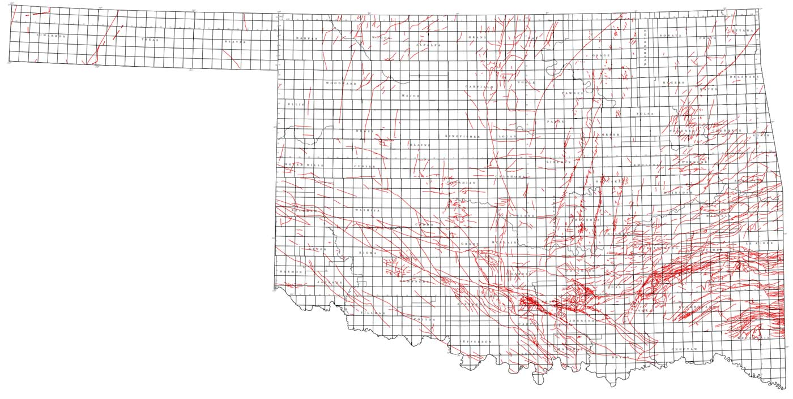

# Chapter 1: Reading up on Oklahoma's Earthquakes

http://www.newyorker.com/magazine/2015/04/13/weather-underground

[NPR's StateImpact project has been covering the issue for the past few years](https://stateimpact.npr.org/oklahoma/tag/earthquakes/)

For a 3-minute video primer on the issue, check out this clip by Reveal/The Center for Investigative Reporting:

<iframe width="853" height="480" src="https://www.youtube.com/embed/AIu3b0WhMgs?rel=0" frameborder="0" allowfullscreen></iframe>

### The cause

In a [2013 article from Mother Jones](http://www.motherjones.com/environment/2013/03/does-fracking-cause-earthquakes-wastewater-dewatering):

> Jean Antonides, vice president of exploration for New Dominion, which operates one of the wells near the Wilzetta Fault. He informed me that people claiming to know the true source of the Oklahoma quakes are "either lying to your face or they're idiots."

The industry's general response is that, yes, earthquakes are happening. But that doesn't mean it's _their_ fault. Until recently, they had the backing of the [Oklahoma Geological Survey](http://www.ogs.ou.edu/homepage.php) (OGS). In a [position statement released in February 2014](http://www.ogs.ou.edu/pdf/OGS_POSITION_STATEMENT_2_18_14.pdf):

> Overall, the majority, but not all, of the recent earthquakes appear
to be the result of natural stresses, since they are consistent with the regional Oklahoma natural stress field.

### Current drilling activity

## The U.S. Geological Survey Earthquake Data

The [U.S. Geological Survey (USGS) Earthquake Hazards Program is a comprehensive clearinghouse of earthquake data](http://earthquake.usgs.gov/) collected and processed by its vast network of seismic sensors. [The Atlantic has a fine article about how (and how _fast_)](http://www.theatlantic.com/technology/archive/2014/03/how-a-california-earthquake-becomes-the-news-an-extremely-precise-timeline/284506/) the slippage of a fault line, 6 miles underground, is detected by USGS sensor stations and turned into data and news feeds.

The earthquake data that we will use is the most simplified version of USGS data: [flat CSV files](http://earthquake.usgs.gov/earthquakes/feed/v1.0/csv.php). While it contains the latitude and longitude of the earthquakes' epicenters, it does not  TKTK

### Limitations of the data

The USGS earthquake data is as ideal of a dataset we could hope to work with. We're not dealing with human voluntary reports of earthquakes, but automated readings from a network of sophisticated sensors. That said, sensors and computers aren't perfect, as the Los Angeles Times and their Quakebot [discovered in May](http://www.latimes.com/local/lanow/la-me-earthquakesa-earthquake-48-quake-strikes-near-san-simeon-calif-2ibr88-story.html). The USGS has a page devoted [to errata in its reports](http://earthquake.usgs.gov/earthquakes/errata.php).

#### Historical reliability of the data

It's incorrect to think of the USGS data as deriving from a monolithic and unchanging network. For one thing, the [USGS partners with universities and industry](http://www.theatlantic.com/technology/archive/2014/03/how-a-california-earthquake-becomes-the-news-an-extremely-precise-timeline/284506/) in operating and gathering data from seismographs. And obviously, technology, and sensors change, as does the funding for installing and operating them. From the [USGS "Earthquake Facts and Statistics" page](http://earthquake.usgs.gov/earthquakes/eqarchives/year/eqstats.php):

> The USGS estimates that several million earthquakes occur in the world each year. Many go undetected because they hit remote areas or have very small magnitudes. The NEIC now locates about 50 earthquakes each day, or about 20,000 a year.
>
> As more and more seismographs are installed in the world, more earthquakes can be and have been located. However, the number of large earthquakes (magnitude 6.0 and greater) has stayed relatively constant.

Is it possible that Oklahoma's recent earthquake swarm in Oklahoma is just the result of the recent installation of a batch of seismographs in Oklahoma? _Could be_ -- though I think it's likely the USGS would have mentioned [this in its informational webpages and documentation about the Oklahoma earthquakes](http://earthquake.usgs.gov/earthquakes/states/index.php?regionID=36). In [chapter 3](#mark-chapter-3), we'll try to use some arithmetic and estimation to address the "Oh, it's only because there's more sensors" possibility. But to keep things relatively safe and simple, we'll limit the scope of the historical data to about 20 years: __from 1995 to August 2015__. The number of sensors and technology may have changed in that span, but not as drastically as they have in even earlier decades. The [USGS has a page devoted to describing the source and caveats of its earthquake data](http://earthquake.usgs.gov/earthquakes/map/doc_aboutdata.php).

### Getting the data

For quick access, the USGS provides real-time data feeds for time periods between an hour to the last 30 days. The [Feeds & Notifications page](http://earthquake.usgs.gov/earthquakes/feed/v1.0/) shows a menu of data formats and services. For our purposes, the [Spreadsheet Format option](http://earthquake.usgs.gov/earthquakes/feed/v1.0/csv.php) is good enough.

To access the entirety of the USGS data, visit their [Archive page](http://earthquake.usgs.gov/earthquakes/search/).

In Chapter 3, I briefly explain the [relatively simple code for automating the collection of this data](#batch-downloading-historical-data). The process isn't that interesting though so if you just want the zipped up data, you can find it in the [repo's __/data__ directory](https://github.com/dannguyen/ok-earthquakes-RNotebook/tree/master/data), in the file named [usgs-quakes-dump.csv.zip](https://github.com/dannguyen/ok-earthquakes-RNotebook/blob/master/data/usgs-quakes-dump.csv.zip). It weighs in at 27.1MB zipped, 105MB uncompressed.

#### Data attributes

The most relevant columns [in the CSV version of the data](http://earthquake.usgs.gov/earthquakes/feed/v1.0/csv.php):

- [time](http://earthquake.usgs.gov/earthquakes/feed/v1.0/glossary.php#time)
- [latitude and longitude](http://earthquake.usgs.gov/earthquakes/feed/v1.0/glossary.php#latitude)
- [mag](http://earthquake.usgs.gov/earthquakes/feed/v1.0/glossary.php#mag), i.e. magnitude
- [type](http://earthquake.usgs.gov/earthquakes/feed/v1.0/glossary.php#type), as in, type of seismic event, which includes earthquakes, explosions, and quarry.
- [place](http://earthquake.usgs.gov/earthquakes/feed/v1.0/glossary.php#place), a description of the geographical region of the seismic event.

__Note:__ a non-trivial part of the USGS data is the measured _magnitude_ of the earthquake. This is not an absolute, set-in-stone number (neither is _time_, for that matter), and the disparities in measurements of magnitude -- [including what state and federal agencies report -- can be a major issue](http://www.tulsaworld.com/earthquakes/state-federal-earthquake-numbers-differ/article_dd824fdc-4cb4-500b-b869-7e6c33d93eb6.html).

However, for our walkthrough, this disparity is minimized because we will be focused on the frequency and quantity of earthquakes, rather than their magnitude.

## The U.S. Census Cartographic Boundary Shapefiles

The USGS data has a `place` column, but it's not specific enough to be able to use in assigning earthquakes to U.S. states. So we need geospatial data, specifically, U.S. state boundaries. The [U.S. Census has us covered](#mark-chapter-1) with zipped-up simplified boundary data:

> The cartographic boundary files are simplified representations of selected geographic areas from the Census Bureau’s MAF/TIGER geographic database.   These boundary files are specifically designed for small scale thematic mapping.

> Generalized boundary files are clipped to a simplified version of the U.S. outline.  As a result, some off-shore areas may be excluded from the generalized files.

> For more details about these files, please see our [Cartographic Boundary File Description page](https://www.census.gov/geo/maps-data/data/cbf/cbf_description.html).

There are shapefiles for various levels of political boundaries. We'll use the ones found on [the states page](https://www.census.gov/geo/maps-data/data/cbf/cbf_state.html). The lowest resolution file -- 1:20,000,000, i.e. 1 inch represents 20 million real inches -- is adequate for our charting purposes.

The direct link to the Census's 2014 1:20,000,000 shape file is [here](https://www.census.gov/geo/maps-data/data/cbf/cbf_counties.html). I've also included it in this repo's `data/` directory.

### The limits of state boundaries

The Census shapefiles are conveniently packaged for the analysis we want to do, though we'll find out in [Chapter 2](#mark-chapter-2) that there's a good amount of complexity in preparing geospatial boundary data for visualization.

But the bigger question is: Are state boundaries really the best way to categorize earthquakes? These boundaries are _political_ and have no correlation with the __seismic__ lines that earthquakes occur along.

To use a quote [from the New Yorker, attributed to Austin Holland](http://www.newyorker.com/magazine/2015/04/13/weather-underground), then-head seismologist of the Oklahoma Geological Survey:

> Someone asked Holland about several earthquakes of greater than 4.0 magnitude which had occurred a few days earlier, across Oklahoma’s northern border, in Kansas. Holland joked, “Well, the earthquakes aren’t stopping at the state line, but my problems do.”

So, even if we assume _something_ man-made is causing the earthquakes, it could very well be drilling in Texas, or any of Oklahoma's other neighbors, that are causing Oklahoma's earthquake swarm. And conversely, earthquakes caused by Oklahoma drilling but occur within other states' borders will be uncounted when doing a strict state-by-state analysis.

Ideally, we would work with the fault map of Oklahoma. For example, the [Oklahoma Geological Survey's Preliminary Fault Map of Oklahoma](http://www.ogs.ou.edu/pubsscanned/openfile/OF3-2015.pdf):

The shapefile for the fault map can be [downloaded as a zip file here](http://wichita.ogs.ou.edu/documents/OF3-2015/OF3-2015.zip), and other data files can be found posted at the [OGS's homepage](http://www.ogs.ou.edu/homepage.php). The reason why I'm not using it for this walkthrough is: it's complicated. As in, it's too complicated for _me_, though I might return to it when I have more time and to update this guide.

But like the lines of political boundaries, the lines of a fault map don't just _exist_. They are discovered, often after an earthquake, and some of the data is voluntary reported by the drilling industry. Per the [New Yorker's April 2015 story](http://www.newyorker.com/magazine/2015/04/13/weather-underground):

> “We know more about the East African Rift than we know about the faults in the basement in Oklahoma.” In seismically quiet places, such as the Midwest, which are distant from the well-known fault lines between tectonic plates, most faults are, instead, cracks within a plate, which are only discovered after an earthquake is triggered. The O.G.S.’s Austin Holland has long had plans to put together two updated fault maps, one using the available published literature on Oklahoma’s faults and another relying on data that, it was hoped, the industry would volunteer; but, to date, no updated maps have been released to the public.

As I'll cover in [chapter 4](#mark-chapter-4) of this walkthrough, things have obviously changed since the New Yorker's story, including the release of updated fault maps.

## About the Oklahoma Corporation Commission

The OCC has many [relevant datasets from the drilling industry](http://www.occeweb.com/og/ogdatafiles2.htm), in particular, spreadsheets of the locations of UIC ([underground injection control](http://water.epa.gov/type/groundwater/uic/)) wells, i.e. where wastewater from drilling operations is injected into the earth for storage.

The data comes in several Excel files, all of which are mirrored in the [data/ directory](https://github.com/dannguyen/ok-earthquakes-RNotebook/tree/master/data). The key fields are the locations of the wells and the volume of injection in barrels per month or year.

Unfortunately, the OCC doesn't seem to have a lot of easily-found documentation for this data. Also unfortunate: this data is essential in attempting to make any useful conclusions about the cause of Oklahoma's earthquakes. In [Chapter 4](#mark-chapter-4), I go into significant detail about the OCC data's limitations, but still fall very short of what's needed to make the data usable..
