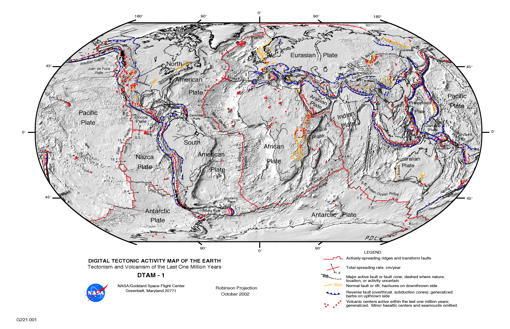

## Loading the libraries and themes

```{r, message = FALSE}
library(ggplot2)
require(grid)
library(dplyr)
library(lubridate)
library(rgdal)
library(maptools)
```

- [ggplot2](http://ggplot2.org/) is _the_ visualization framework. Made by Hadley Wickham.
- [dplyr](https://cran.rstudio.com/web/packages/dplyr/vignettes/introduction.html), also made by Hadley Wickham, is a library for manipulating dataframes and includes transformations such as `mutate()` and `filter()` as well as aggregation functions. It also has [nice piping](http://seananderson.ca/2014/09/13/dplyr-intro.html), which warms the Unix programmer inside me.
- [lubridate](https://github.com/hadley/lubridate) - I include Wickham's time-handling library only for its convenience functions, such as [year()](https://cran.r-project.org/web/packages/lubridate/vignettes/lubridate.html), which seems like overkill if you've never dealt with trying to parse time values as a programmer. Think of it as [moment.js for R](http://momentjs.com/).
- [readxl](https://github.com/hadley/readxl) - Later on we'll need to read from an XLS file. Again, via Hadley Wickham.
- [grid](https://stat.ethz.ch/R-manual/R-devel/library/grid/html/grid-package.html) - contains some functionality that ggplot2 uses for chart styling, particularly the [unit()](https://stat.ethz.ch/R-manual/R-devel/library/grid/html/unit.html) function.
- [rgdal](https://cran.r-project.org/web/packages/rgdal/index.html) - bindings for geospatial operations, including map projection and the reading of map shapefiles. Can be a bear to install due to a variety of dependencies. If you're on OS X, I recommend [installing Homebrew](http://brew.sh/) and running `brew install gdal` before installing the rgdal package via R.


```{r, message = F}
source("./myslimthemes.R")
theme_set(theme_dan())
```


## Downloading the data

There are two data files we need:

- __[A feed of earthquake reports in CSV format from the U.S. Geological Survey](http://earthquake.usgs.gov/earthquakes/feed/v1.0/csv.php).__ For this section, we'll start by using the ["Past 30 Days - All Earthquakes"](http://earthquake.usgs.gov/earthquakes/feed/v1.0/summary/all_month.csv) feed, which can be downloaded at this URL:

    http://earthquake.usgs.gov/earthquakes/feed/v1.0/summary/all_month.csv

- __[Cartographic boundary shapefiles for U.S. state boundaries, via the U.S. Census](https://www.census.gov/geo/maps-data/data/tiger-cart-boundary.html)__. The listing of state boundaries can be [found here](https://www.census.gov/geo/maps-data/data/cbf/cbf_state.html). There are several levels of detail; the resolution of `1:20,000,000` is good enough for our purposes:

    http://www2.census.gov/geo/tiger/GENZ2014/shp/cb_2014_us_state_20m.zip


If you're following along many years from now and the above links no longer work, the [Github repo for this walkthrough](https://github.com/dannguyen/ok-earthquakes-RNotebook) contains copies of the raw files for you to practice on. You can either just clone this repo to get the files. Or download them here (these URLs are subject to the whims of Github's framework and may change down the road):

- [https://raw.githubusercontent.com/dannguyen/ok-earthquakes-RNotebook/master/data/all_month.csv](https://raw.githubusercontent.com/dannguyen/ok-earthquakes-RNotebook/master/data/all_month.csv)
- [https://raw.githubusercontent.com/dannguyen/ok-earthquakes-RNotebook/master/data/cb_2014_us_state_20m.zip](https://raw.githubusercontent.com/dannguyen/ok-earthquakes-RNotebook/master/data/cb_2014_us_state_20m.zip)


First we create a data directory to store our files:

```{r, message = F}
dir.create('./data')
```


### Download earthquake data into a data frame

Because the data files can get big, I've included an `if` statement so that if a file exists at `./data/all_month.csv`, the `download` command won't attempt to re-download the file.


```{r, message = FALSE}
url <- "http://earthquake.usgs.gov/earthquakes/feed/v1.0/summary/all_month.csv"
fname <- "./data/all_month.csv"
if (!file.exists(fname)){
  print(paste("Downloading: ", url))
  download.file(url, fname)
}
```

The standard __read.csv()__ function can be used to convert the CSV file into a data frame, which I store into a variable named `usgs_data`:

```{r, message = F}
usgs_data <- read.csv(fname, stringsAsFactors = FALSE)
```


### Download and read the map data

```{r, message = FALSE}
url <- "http://www2.census.gov/geo/tiger/GENZ2014/shp/cb_2014_us_state_20m.zip"
fname <- "./data/cb_2014_us_state_20m.zip"
if (!file.exists(fname)){
  print(paste("Downloading: ", url))
  download.file(url, fname)
}
unzip(fname, exdir = "./data/shp")
```

Inside the `data/` directory should be a subdirectory named `shp/` with a variety of data files. Using the __rgdal__ library, we use the `readOGR()` command to read the shape file, convert it to a __SpatialPolygonsDataFrame__-type object, and assign it to the variable `us_map`:

```{r, message = FALSE}
us_map <- readOGR("./data/shp/cb_2014_us_state_20m.shp", "cb_2014_us_state_20m")
```


Going forward, we can work knowing that `usgs_data` and `us_map` contain data frames for the earthquakes and the U.S. state boundaries, respectively.


## Organizing the earthquake data

Let's count how many earthquake records there are in a month's worth of USGS earthquake data:

```{r, message = F}
nrow(usgs_data)
```

The USGS data feed contains more than just earthquakes, though. So we use dplyr's  __group_by()__ function on the `type` column and then __summarise()__ the record counts:

```{r, message = F}
usgs_data %>% group_by(type) %>% summarise(count = n())
```

For this particular journalstic endeavour, we don't care about explosions and quarry blasts. We also only care about events of a reasonable magnitude &ndash; [remember that magnitudes under 3.0 are often not even noticed by the average person](http://earthquake.usgs.gov/learn/topics/mag_vs_int.php). Let's use `group_by()` and `summarise()` again, but faceted around the `mag` column (rounded to the nearest integer), to see the distribution:

```{r, message = F}
usgs_data %>% group_by(round(mag)) %>% summarise(count = n())
```

And to get warmed up for visualization with __ggplot2__, let's view the distribution with a histogram; note that the use of __geom_histogram()__ obiviates the need to do a summarization:

```{r, message = F}
ggplot(usgs_data, aes(x = round(mag))) +
  geom_histogram(binwidth = 1) +
  scale_x_discrete()
```

The [July 28, 2015 Reuters report](https://news.yahoo.com/more-bigger-drilling-linked-earthquakes-rattle-oklahoma-073805543.html) focused on Oklahoma earthquakes of 3.0 magnitude or above, so let's filter `usgs_data` appropriately and store it in a variable named `quakes`:

```{r, message = F}
quakes <- usgs_data %>% filter(mag >= 3.0, type == 'earthquake')
```

The `quakes` dataframe is now about a tenth the size of the data we original downloaded, which will work just fine for our purposes:

```{r, message = F}
nrow(quakes)
```


### Plotting the earthquake data without a map

It's worth remembering that a geographical map can be thought of a [plain ol' scatter plot](http://docs.ggplot2.org/0.9.3/geom_point.html). In this case, each dot is plotted using the __longitude__ and __latitude__ values, which serve as the __x__ and __y__ coordinates, respectively:

```{r, message = F}
ggplot(quakes, aes(x = longitude, y = latitude)) + geom_point()
```

Even without the world map boundaries, we can see in the locations of the earthquakes a rough outline of the world's fault lines:



With ~1,000 points &ndash; and, in the next chapter, __20,000+__ points, we run into a problem of [__overplotting__](http://www.cookbook-r.com/Graphs/Scatterplots_(ggplot2)/#handling-overplotting), in which multiple earthquake events in close proximity to each other all overlap and appear to be a single point.

There are several ways of dealing with this, including:

- Increasing the _size_ of each point.
- Increasing the _translucency_, i.e. the __alpha__ of each point.
- Changing the [_shape_ of each point](http://www.cookbook-r.com/Graphs/Shapes_and_line_types/) to something such as a hollow circle.

And just to add some variety, I'll change the [color](http://www.stat.columbia.edu/~tzheng/files/Rcolor.pdf) of the points from black to `firebrick`:

We can apply these styles in the `geom_point()` call:

```{r, message = F}
ggplot(quakes, aes(x = longitude, y = latitude)) +
  geom_point(size = 3,
             alpha = 0.2,
             shape = 1,
             color = 'firebrick')
```

#### Varying the size by magnitude

Obviously, some earthquakes are more momentous than others. An easy way to show this would be to vary the _size_ of the point by `mag`:


```{r, message = F}
ggplot(quakes, aes(x = longitude, y = latitude)) +
  geom_point(aes(size = mag),
             alpha = 0.2,
             shape = 1,
             color = 'firebrick')
```

However, this understates the difference between earthquakes; remember that moving up [_one_ step means an increase in energy release by a __factor of 32__; __two__ steps is a factor of __1000__](https://en.wikipedia.org/wiki/Richter_magnitude_scale). Scaling the circles accurately will be...a little awkward. And I also don't know enough about ggplot to map the legend's labels to the proper non-transformed values. In any case, for the purposes of this investigation, we mostly care about the _frequency_ of earthquakes, rather than their actual magnitudes, so I'll leave out the size aesthetic in the examples.


Let's move on to plotting the boundaries of the United States.


## Plotting the map boundaries

The data contained in the `us_map` variable is actually a _kind_ of data frame, a __SpatialPolygonsDataFrame__, which is provided to us as part of the [__sp__ package](https://cran.r-project.org/web/packages/sp/sp.pdf), which was included via the [rgdal](https://cran.r-project.org/web/packages/rgdal/index.html) package.

Since `us_map` is a data frame, it's pretty easy to plop it right into ggplot():

```{r, message = FALSE}
ggplot() +
  geom_polygon(data = us_map, aes(x = long, y = lat, group = group)) +
   theme_dan_map()
```

By default, things look a little squished because the longitude and latitude values are treated as values on a flat, 2-dimensional plane. As we've learned, the world is _not_ flat. So to have the geographical points -- in this case, the polygons that make up state boundaries -- look more like we're accustomed to on a globe, we have to _project_ the coordinates.

This is a cartographic concept that is beyond my ability to concisely and intelligibly explain, so I direct you to Michael Corey, of the Center for Investigative Reporting, and his explainer, ["Choosing the Right Map Projection"](https://source.opennews.org/en-US/learning/choosing-right-map-projection/). And Mike Bostock has a series of [excellent interactive examples showing some of the complexities of map projection](http://bost.ocks.org/mike/example/#1); I embed one of his D3 examples below:


<iframe src="http://bl.ocks.org/dannguyen/raw/36e0f357433dda000dc0/918717fa8db0d0f8d8460026b4a41815b82362de/" width="700" height="400" marginwidth="0" marginheight="0" scrolling="no"></iframe>


Once you understand map projections, or at least are aware of their existence, applying them to ggplot() is straightforward. In the snippet below, I apply the [__Albers__ projection](https://en.wikipedia.org/wiki/Albers_projection), which is the standard projection for the U.S. Census (and Geological Survey) using the __coord_map()__ function. Projecting in Albers requires a couple of parameters that [I'm just going to copy and modify from this r-bloggers example](https://rud.is/b/2015/03/15/simple-lower-us-48-albers-maps-local-no-api-citystate-geocoding-in-r/), though I assume it has something to do with [specifying the parallels needed for accurate proportions](https://cran.r-project.org/web/packages/mapproj/mapproj.pdf):


```{r, message = FALSE}
ggplot() +
  geom_polygon(data = us_map, aes(x = long, y = lat, group = group)) +
  coord_map("albers", lat0 = 38, latl = 42) + theme_classic()
```


### Filtering out Alaska and Hawaii

The U.S. Census boundaries only contains data for the United States. So why does our map span the entire globe? Because Alaska has the annoying property of being [both the most western *and* eastern point of the United States](https://en.wikipedia.org/wiki/Extreme_points_of_the_United_States), such that it wraps around to the other side of our coordinate system, i.e. from longitude -179 to 179.

There's obviously [a more graceful, mathematically-proper way of translating the coordinates](https://rud.is/b/2014/11/16/moving-the-earth-well-alaska-hawaii-with-r/) so that everything fits nicely on our chart. But for now, to keep things simple, let's just remove Alaska -- and Hawaii, and all the non-states -- as that gives us an opportunity to practice filtering SpatialPolygonsDataFrames.

First, we inspect the column names of `us_map`'s _data_ to see which one corresponds to the _name_ of each polygon, e.g. `Iowa` or `CA`:

```{r, message = F}
colnames(us_map@data)
```

Both __NAME__ and __STUSPS__ (which I'm guessing stands for _U.S. Postal Code_) will work:

```{r, message = F}
head(select(us_map@data, NAME, STUSPS))
```

To filter out the data that corresponds to Alaska, i.e. `STUSPS == "AK"`:

```{r, message = F}
byebye_alaska <- us_map[us_map$STUSPS != 'AK',]
```

To filter out Alaska, Hawaii, and the non-states, e.g. Guam and Washington D.C., and then assign the result to the variable `usc_map`:

```{r, message = F}
x_states <- c('AK', 'HI', 'AS', 'DC', 'GU', 'MP', 'PR', 'VI')
usc_map <- us_map[!(us_map$STUSPS %in% x_states), ]
# alternatively, using subset():
usc_map <- subset(us_map, !(us_map$STUSPS %in% x_states))
```


Now let's map the _contiguous_ United States, and, while we're here, let's change the style of the map to be in dark outline with white fill:

```{r, message = F}
ggplot() +
  geom_polygon(data = usc_map, aes(x = long, y = lat, group = group),
                 fill = "white", color = "#444444", size = 0.1) +
  coord_map("albers", lat0 = 38, latl = 42)

```


### Plotting the quakes on the map

Plotting the earthquake data on top of the United States map is as easy as adding two layers together; notice how I plot the map boundaries before the points, or else the map (or rather, its _white fill_) will cover up the earthquake points:

```{r, message = F}
ggplot(quakes, aes(x = longitude, y = latitude)) +
  geom_polygon(data = usc_map, aes(x = long, y = lat, group = group),
                   fill = "white", color = "#444444", size = 0.1) +
  geom_point(size = 3,
               alpha = 0.2,
               shape = 1,
               color = 'firebrick') +
  coord_map("albers", lat0 = 38, latl = 42) +
  theme_dan_map()
```

Well, that turned out poorly. The viewpoint reverts to showing the entire globe. The  problem is easy to understand: the plot has to account for both the United States boundary data _and_ the worldwide locations of the earthquakes.

In the next section, we'll tackle this problem by converting the earthquakes data into its own spatial-aware data frame and then _cross-referencing_ it with the data in `usc_map` to remove earthquakes that don't originate from within the boundaries of the contiguous United States.


## Working with and filtering spatial data points

To reiterate, `usc_map` is a __SpatialPolygonsDataFrame__, and `quakes` is a plain data frame. We want to use the geodata in `usc_map` to remove all earthquake records that don't take place within the boundaries of the U.S. contiguous states.

The first question to ask is: why don't we just filter `quakes` by one of its columns, like we did for `mag` and `type`? The problem is that while the USGS data has a `place` column, it is not U.S.-centric, i.e. there's not an easy way to say, _"Just show me records that take place within the United States"_, because `place` doesn't always mention the country:

```{r, message = F}
head(quakes$place)
```

So instead, we use the latitude/longitude coordinates stored in `usc_map` to filter out earthquakes by _their_ latitude/longitude values. The math to do this from scratch is quite...labor intensive. Luckily, the __sp__ library can do this work for us, we just have to first convert the `quakes` data frame into one of sp's special data frames: a __SpatialPointsDataFrame__.

```{r, message = F}
sp_quakes <- SpatialPointsDataFrame(data = quakes,
                          coords = quakes[,c("longitude", "latitude")])
```

Then we assign it the same __projection__ as `us_map` (note that `usc_map` also has this same projection). First let's inspect the actual projection of `us_map`:

```{r, message = F}
us_map@proj4string
```

Now assign that value to `sp_quakes` (which, by default, has a `proj4string` attribute of `NA`):

```{r, message = F}
sp_quakes@proj4string <- us_map@proj4string
```

Let's see what the map plot looks like. Note that in the snippet below, I don't use `sp_quakes` as the data set, but `as.data.frame(sp_quakes)`. This conversion is necessary as ggplot2 doesn't know how to deal with the SpatialPointsDataFrame (and yet it does fine with SpatialPolygonsDataFrames...whatever...):


```{r, message = F}
ggplot(as.data.frame(sp_quakes), aes(x = longitude, y = latitude)) +
  geom_polygon(data = usc_map, aes(x = long, y = lat, group = group),
                   fill = "white", color = "#444444", size = 0.1) +
  geom_point(size = 3,
               alpha = 0.2,
               shape = 1,
               color = 'firebrick') +
  coord_map("albers", lat0 = 38, latl = 42) +
  theme_dan_map()
```

No real change...we've only gone through the process of making a spatial points data frame. Creating that spatial data frame, then converting it back to a data frame to use in ggplot() has basically no effect -- though it _would_ if the geospatial data in `usc_map` had a projection that significantly transformed its lat/long coordinates.

### How to subset a spatial points data frame

To see the change that we want &ndash; just earthquakes in the contiguous United States &ndash; we _subset_ the spatial points data frame, i.e. `sp_quakes`, using `usc_map`. This is actually quite easy, and uses similar notation as when subsetting a plain data frame:


```{r, message = F}
sp_usc_quakes <- sp_quakes[usc_map,]
```


I actually don't know enough about basic R notation and __S4__ objects to know or explain _why_ this works, but it does _just work_:

```{r, message = F}
usc_quakes <- as.data.frame(sp_usc_quakes)

ggplot(usc_quakes, aes(x = longitude, y = latitude)) +
  geom_polygon(data = usc_map, aes(x = long, y = lat, group = group),
                   fill = "white", color = "#444444", size = 0.1) +
  geom_point(size = 3,
               alpha = 0.5,
               shape = 1,
               color = 'firebrick')  +
  coord_map("albers", lat0 = 38, latl = 42) +
  theme_dan_map()
```

### Subsetting points by state

What if we want to just show earthquakes in California? We first subset `usc_map`:

```{r, message = F}
ca_map <- us_map[us_map$STUSPS == 'CA',]
```

Then we use `ca_map` to filter `sp_quakes`:

```{r, message = F}
ca_quakes <- as.data.frame(sp_quakes[ca_map,])
```

Mapping California and its quakes:

```{r, message = F}
ggplot(ca_quakes, aes(x = longitude, y = latitude)) +
  geom_polygon(data = ca_map, aes(x = long, y = lat, group = group),
                   fill = "white", color = "#444444", size = 0.1) +
  geom_point(size = 3,
               alpha = 0.8,
               shape = 1,
               color = 'firebrick')  +
  coord_map("albers", lat0 = 38, latl = 42) +
  theme_dan_map()
```


## Joining shape file attributes to a data frame

The process of subsetting `usc_map` for each state, _then_ subsetting the `sp_quakes` data frame, is a little cumbersome. Another approach is to _add a new column_ to the earthquakes data frame that specifies which state the earthquake was in.

As I mentioned previously, the USGS data has a `place` column, but it doesn't follow a structured taxonomy of geographical labels and serves primarily as a human-friendly label, e.g. `"South of the Fiji Islands"` and `"Northern Mid-Atlantic Ridge"`.

So let's add the `STUSPS` column to `sp_quakes`. For this, we use the __sp__ package's __over()__ function, which will join the rows of `sp_quakes` to the `STUSPS` column of `usc_map`, for quakes in which the geospatial coordinates overlap with the polygons in `usc_map`:


```{r, message = F}
xdf <- over(sp_quakes, usc_map[, 'STUSPS'])
```

Most of the `STUSPS` values in `xdf` will be `<NA>` because, most of the earthquakes do not take place in the United States. Though we see of all the contiguous United States, Oklahoma (i.e. `OK`) has experienced the most earthquakes by far in this month-long dataset:

```{r, message = F}
xdf %>% group_by(STUSPS) %>%
        summarize(count = n()) %>%
        arrange(desc(count))
```

To get a data frame of contiguous U.S.-only quakes, we merge `xdf` with `sp_quakes`, then filter the result by removing all rows in which `STUSPS` is `<NA>`:

```{r, message = F}
ydf <- cbind(sp_quakes, xdf) %>% filter(!is.na(STUSPS))
usc_quakes <- as.data.frame(ydf)
```

How is this different than before, when we derived `usc_quakes` like so:

```{r, message = F}
old_usc_quakes <- as.data.frame(sp_quakes[usc_map,])
```

Try it; the resulting number of rows will be the same. However, the difference in our latest approach is that `usc_quakes` has that additional `STUSPS` column:

```{r, message = F}
head(select(usc_quakes, place, STUSPS))
```

Which, among other things, makes it possible to do aggregates of the earthquakes dataframe by `STUSPS`:

```{r, message = F}
ggplot(usc_quakes, aes(STUSPS)) + geom_histogram(binwidth = 1)
```

At this point, we've covered just about all the data-munging and visualization techniques we need to effectively analyze and visualize the historical earthquake data for the United States.


<!--
To render this file:
library(rmarkdown)
setwd("~/Dropbox/rprojs/ok-earthquakes-Rnotebook/")

this_file <- 'basic-r-concepts.Rmd'
render(this_file, output_dir = './builds',
  html_document(toc = TRUE, self_contained = F))

render(this_file, output_dir = './builds',
  md_document(variant = "markdown_github",
              preserve_yaml = TRUE))
-->
