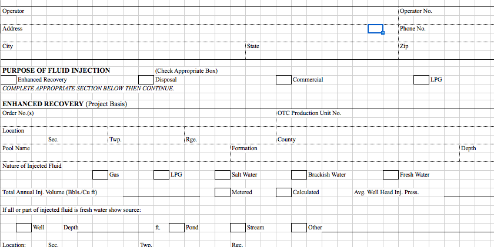
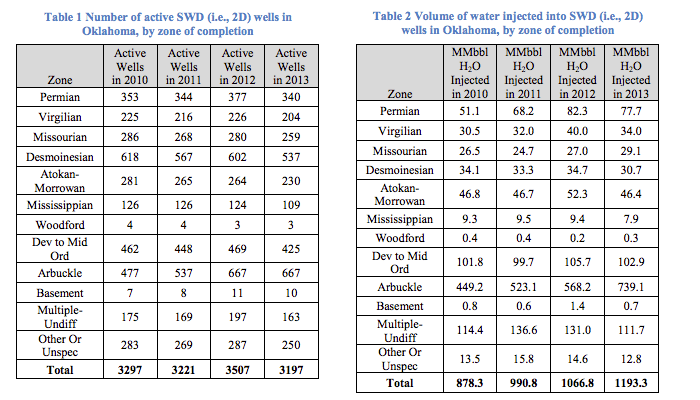

<a id="mark-chapter-4"></a>

# Chapter 4: Correlation, limitations, and known unknowns


Questions to answer:
- What are the geospatial characteristics of the recent Earthquakes?
- Is the recent spurt of earthquakes located in one area?
- What is the correlation between well activity and earthquakes?


## Setup


- [readxl](https://github.com/hadley/readxl) - Later on we'll need to read from Excel spreadsheets.


```{r, warning = F, message = FALSE}
# Load libraries
library(ggplot2)
library(grid)
library(gridExtra)
library(dplyr)
library(lubridate)
library(rgdal)
library(readxl)
library(scales)
library(ggmap)
# load my themes:
source("./myslimthemes.R")
theme_set(theme_dan())

# create a data directory
dir.create('./data')

```

Download the map data as before:

```{r, warning = F, message = F,  results = "hide", cache = TRUE, cache.path = "/tmp/rstudio-cache/ok-earthquakes-4"}
fname <- "./data/cb_2014_us_state_20m.zip"
if (!file.exists(fname)){
  url <- "http://www2.census.gov/geo/tiger/GENZ2014/shp/cb_2014_us_state_20m.zip"
  print(paste("Downloading: ", url))
  download.file(url, fname)
}
unzip(fname, exdir = "./data/shp")
#
# Read the map data
us_map <- readOGR("./data/shp/cb_2014_us_state_20m.shp", "cb_2014_us_state_20m")
states_map <- us_map[!us_map$STUSPS %in%
                        c('AS', 'DC', 'GU', 'MP', 'PR', 'VI'),]

```


Download and read the quakes data as before:


```{r, warning = F, message = F, cache = TRUE, cache.path = "/tmp/rstudio-cache/ok-earthquakes-4"}
fn <- './data/usgs-quakes-dump.csv'
zname <- paste(fn, 'zip', sep = '.')
if (!file.exists(zname) || file.size(zname) < 2048){
  url <- paste("https://github.com/dannguyen/ok-earthquakes-RNotebook",
    "raw/master/data", zname, sep = '/')
  print(paste("Downloading: ", url))
  # note: if you have problems downloading from https, you might need to include
  # RCurl
  download.file(url, zname, method = "libcurl")
}
unzip(zname, exdir="data")
# read the data into a dataframe
usgs_data <- read.csv(fn, stringsAsFactors = FALSE)
```

Filter and mutate the data

```{r, warning = F, message = F, cache = TRUE, cache.path = "/tmp/rstudio-cache/ok-earthquakes-4"}
# Remove all non earthquakes and events with magnitude less than 3.0:
quakes <- usgs_data %>%
          filter(mag >= 3.0, type == 'earthquake') %>%
          mutate(time = ymd_hms(time)) %>%
          mutate(date = as.Date(time)) %>%
          mutate(year = year(time))
```


```{r, warning = F, message = F, cache = TRUE, cache.path = "/tmp/rstudio-cache/ok-earthquakes-4"}
sp_quakes <- SpatialPointsDataFrame(data = quakes,
                coords = quakes[,c("longitude", "latitude")])
sp_quakes@proj4string <- states_map@proj4string
# subset for earthquakes in the U.S.
xdf <- over(sp_quakes, states_map[, 'STUSPS'])
states_quakes <- cbind(sp_quakes, xdf) %>% filter(!is.na(STUSPS))
# add a convenience column for Oklahoma:
states_quakes <- mutate(states_quakes, is_OK = STUSPS == 'OK')
```

Making data frames for just Oklahoma:

```{r, warning = F, message = F, cache = TRUE, cache.path = "/tmp/rstudio-cache/ok-earthquakes-4"}
# Dataframe of just Oklahoma quakes:
ok_quakes <- filter(states_quakes, is_OK)
# map of just Oklahoma state:
ok_map <- states_map[states_map$STUSPS == 'OK',]
```


## Location is everything

In [chapter 3](#mark-small_multiples_oklahoma_map_quakes), we created a few national and Oklahoma maps before moving on to histograms, which were more effective for quantifying the frequency and number of earthquakes.

But now that we're pretty well convinced that Oklahoma is facing unprecedented seismic activity, it's necessary to focus on the earthquakes' _locations_ in order to make any kind of correlation between their occurrence and human activity.

Revisiting this small-multiples map from [Chapter 3](#mark-small_multiples_oklahoma_map_quakes):


Let's facet earthquakes by year, within the period of 2011 to 2015:

```{r, small_multiples_oklahoma_map_quakes_2011_2015,  message = F}
ok_quakes_2010_2015 <- filter(ok_quakes, year >= 2010)
ggplot() +
  geom_polygon(data = ok_map, aes(x = long, y = lat, group = group), fill = "white", color = "#777777") +
  geom_point(data = ok_quakes_2010_2015, aes(x = longitude, y = latitude), shape = 1,  alpha = 0.5, color = "red") +
  coord_map("albers", lat0 = 38, latl = 42) +
  theme_dan_map() +
  facet_wrap(~ year, ncol = 3) +
  ggtitle("Oklahoma M3.0+ earthquakes by time period")
```

### Getting geographically oriented

The Census boundaries have worked nicely for our charting. But they lack geographical information, such as city and landmark location. Let's use the [__ggmap__ library](https://github.com/dkahle/ggmap) to bring in OpenStreetMap data, via the [Stamen toner layers](http://maps.stamen.com/toner/#12/37.7706/-122.3782):


```{r, ok_stamen_map_base, warning = F, message = F, cache = TRUE, cache.path = "/tmp/rstudio-cache/ok-earthquakes-4"}
ok_bbox <- c( left = -103.3, right = -94.2, bottom = 33.5, top = 37.1)
ok_stamen_map <- get_stamenmap(bbox = ok_bbox, zoom = 7, maptype =  "toner", crop = T)
gg_ok_map <- ggmap(ok_stamen_map) +
             geom_polygon(data = ok_map, aes(x = long, y = lat, group = group),
                           fill = NA, color = "#222222")

gg_ok_map
```

Rather than overlaying the earthquakes as dots, let's use hexbinning so that we don't obscure the geographical labels:

```{r, ok_stamen_map_2011_2015_hexbin, warning = F, message = F, cache = TRUE, cache.path = "/tmp/rstudio-cache/ok-earthquakes-4", fig.height = 12, fig.width = 12}
gg_ok_map +
  stat_binhex(data = filter(ok_quakes_2010_2015, year == 2011 | year == 2015), aes(x = longitude, y = latitude, color = ..count..), bins = 40, fill = NA) +
  guides(fill = F) +
  scale_color_gradientn(colours=c("gray","red")) +
  facet_wrap(~ year, ncol = 1) +
  ggtitle("Oklahoma M3.0+ earthquake density, 2011 and 2015") +
  theme_dan_map()
```

Let's define two areas of interest:

Enid area:

```{r, enid_bbox, warning = F, message = F}
enid_bbox <- c(xmin = -99.2, xmax = -96.5, ymin = 36.2, ymax = 37)
enid_rect_layer <- annotate(geom = "rect", xmin = enid_bbox['xmin'],
                      xmax = enid_bbox['xmax'],
                      ymin = enid_bbox['ymin'],
                      ymax = enid_bbox['ymax'],
                      fill = "NA", color = "purple", linetype = "dashed", size = 1)
gg_ok_map + enid_rect_layer + ggtitle("Enid area")
```

OK City area:

```{r, okcity_bbox, warning = F, message = F}
okcity_bbox <- c(xmin = -98, xmax = -96.3, ymin = 35.3, ymax = 36.19)
okcity_rect_layer <- annotate(geom = "rect", xmin = okcity_bbox['xmin'],
                      xmax = okcity_bbox['xmax'],
                      ymin = okcity_bbox['ymin'],
                      ymax = okcity_bbox['ymax'],
                      fill = "NA", color = "forestgreen", linetype = "dashed", size = 1)
gg_ok_map + okcity_rect_layer + ggtitle("OK City area")
```


Let's examine our bounding boxes:

```{r, small_multiples_oklahoma_map_quakes_2011_2015_with_bboxes,  message = F}
ok_quakes_2010_2015 <- filter(ok_quakes, year >= 2010)
ggplot() +
  geom_polygon(data = ok_map, aes(x = long, y = lat, group = group), fill = "white", color = "#777777") +
  geom_point(data = ok_quakes_2010_2015, aes(x = longitude, y = latitude), shape = 1,  alpha = 0.5, color = "red") +
  okcity_rect_layer +
  enid_rect_layer +
  coord_map("albers", lat0 = 38, latl = 42) +
  theme_dan_map() +
  facet_wrap(~ year, ncol = 3) +
  ggtitle("Oklahoma M3.0+ earthquakes by time period\nEnid and OK City areas inset")
```

I know it's bad to make judgments based on eye-balling a chart, but I think the specified areas encompass _most_ of Oklahoma's earthquake activity.


Let's get the earthquakes for each bounding box into their own variables:

```{r, warning = F, message = F}
# Oklahoma City area quakes
ok_city_quakes <- ok_quakes %>%
                      filter(longitude >= okcity_bbox['xmin'],
                             longitude < okcity_bbox['xmax'],
                             latitude >= okcity_bbox['ymin'],
                             latitude < okcity_bbox['ymax'])

enid_quakes <- ok_quakes %>%
                      filter(longitude >= enid_bbox['xmin'],
                             longitude < enid_bbox['xmax'],
                             latitude >= enid_bbox['ymin'],
                             latitude < enid_bbox['ymax'])
```

### Our hypothesis

Now that we've specified areas of interest, we can use them to test a hypothesis more geographically precise than "Drilling within the Oklahoma's borders are the cause of earthquakes within the Oklahoma's borders""

Specifically: if injection wells are the cause of Oklahoma's recent earthquake surge, then we should expect to find increased injection well activity in the "Enid area" and "OK City area" bounding boxes.

Again, if we were real geologists, we would probably start with the fault maps, or any of the other geological-specific shape files found at the [Oklahoma Geological Survey](http://www.ogs.ou.edu/homepage.php). But let's see how far we can get with our ad-hoc defined regions.


## Understanding the data on Oklahoma's underground injection control (UIC) wells

We now turn our attention to the Oklahoma Corporation Commission. The OCC regulates the state of Oklahoma's utilities, including oil and gas drilling. The OCC's Oil and Gas Division [maintains a variety of records and databases about drilling activity](http://www.occeweb.com/og/ogdatafiles2.htm). The spreadsheets titled "UIC INJECTION VOLUMES" are the most relevant to our current work.

The spreadsheets cover 2006 to 2013. All of these files are mirrored in the `data/` directory of the walkthrough repo.  I'll list the direct links to the OCC files here:

- [All UIC 1012A Reports (2006-2010)](http://www.occeweb.com/og/all_2006-2010uic_1012a.xls)
- [UIC Injection Volumes 2011](http://www.occeweb.com/og/2011INJECTIONVOLUMES.xlsx)
- [UIC Injection Volumes 2012](http://www.occeweb.com/og/2012Injections20141029.xlsx)
- [UIC Injection Volumes 2013](http://www.occeweb.com/og/2013%20UIC%20Injection%20Volumes%20Report.xlsx)

What kind of data do these files contain and how often are they updated? How is the data collected? What is a "1012A" Report? These are all very important questions for which __I do not have official answers__. I did not do much research into the OCC's operations beyond a cursory browsing of their website, which does not contain a lot of documentation. So just to be clear, as I'll repeat many times over in the following sections, you are now reading my train of thoughts and speculations. Be careful __not to interpret them as canonical facts__.

If you visit the [OCC data page](http://www.occeweb.com/og/ogdatafiles2.htm), you'll see that each of the files helpfully lists a contact person and their direct phone number. If we were actually intending to do a publishable report/paper, the first thing we would do is call those numbers and perhaps even visit the office. Just to reiterate, those steps have not been taken in the process of creating this walkthrough.

### Working off of others' work

Although whether you plan to call direct sources at the OCC or not, you should always attempt some research on your own, at least to spare people from having to answer your most basic questions, e.g. "What is a Form 1012A?"

__Pro-tip:__ In case you're curious, the Form 1012A is an annual fluid injection report submitted by UIC operators to the OCC. You can download it from the [OCC's FTP site as an Excel spreadsheet](ftp://www.occeweb.com/OCCFILES/O%26gforms/1012A.XLS). I've also included a copy in the repo's docs/ directory. It is _always_ recommended that you examine the submission forms that make up source data. What the forms ask for, and how they are submitted, almost always has huge implications about the quality of the data. I'm skipping that exercise for this walkthrough. But here's a screenshot:




Let's now take advantage of other researchers and scientists who have used the data. Their papers' methodology sections contain helpful insights about how they wrangled the data.

#### "Oklahoma’s recent earthquakes and saltwater disposal", Stanford, 2015

I'll start off with a recent paper funded by the [Stanford Center for Induced and Triggered Seismicity](https://scits.stanford.edu/about):

__Oklahoma’s recent earthquakes and saltwater disposal__ by F. Rall Walsh III and Mark D. Zoback, June 18, 2015, _Science Advances_: [abstract](http://advances.sciencemag.org/content/1/5/e1500195) [pdf](http://advances.sciencemag.org/content/1/5/e1500195.full-text.pdf+html) [Stanford news article](http://news.stanford.edu/news/2015/june/okla-quake-drilling-061815.html)

Note that while I work at the same university as researcher Walsh and Professor Zoback, I've never met them personally, though I'll happily declare that they are both far more authoritative than me on the topic at hand.

Here's what Walsh et al. found in the OCC data:

##### Problems

> A number of entries in the UIC database had obvious errors, either in the listed monthly injection rates or in the well locations. For example, some wells appeared multiple times in the database. In other cases, either the locations of the wells were not reported or the reported latitude and/or longitude placed the wells outside of Oklahoma. Fortunately, the cumulative volume of injection associated with these wells is only about 1% of the statewide injection in recent years.

> Unreasonably large monthly injection volumes in the database were corrected by fixing obvious typographical errors or taking the median of five adjacent months of data. Fewer than 100 monthly injection volumes (out of more than 1.5 million) were corrected in this way.

> In general, the most recent injection data are more reliable than the older data.

##### Key benchmarks from Walsh

The problems that Walsh et. al find in the data are pretty considerable, though not unusual compared to most real-world datasets. But cleaning it properly will take considerably more research and time than I'm going to devote right now.

That said, it's always a good strategy to find clear __benchmarks__ that we can compare our analysis against, just so that we have an idea of how far off we might be. Here's a couple of numerical assertions by Walsh et al:


> The locations of 5644 wells that injected more than 30,000 barrels (~4800 m3) in any month in 2011– 2013 are mapped in Fig. 1.

> As can be seen in Fig. 2, the aggregate monthly injection volume in the state gradually doubled from about 80 million barrels/month in 1997 to about 160 million barrels/month in 2013, with nearly all of this increase coming from SWD not EOR


#### "A comparison of seismicity rates...in Oklahoma and California", Caltech, 2015

__A comparison of seismicity rates and fluid-injection operations in Oklahoma and California: Implications for crustal stresses__ by Thomas Göbel, June 2015, _The Leading Edge_: [abstract](http://library.seg.org/doi/abs/10.1190/tle34060640.1) [pdf](http://library.seg.org/doi/pdf/10.1190/tle34060640.1)

I only skimmed this paper and am hoping to return to it later (if you're not connected to an academic network, you may not be able to access the full-version). However, I read it far enough to get to these pertinent paragraphs:

> In Oklahoma, cumulative annual injection volumes were determined by summing over all individual well records from the OCC database and comparing them with published values between 2009 and 2013 (Murray, 2014). Murray (2014) performs a detailed data-quality assessment and removes obvious outliers. Consequently, annual injection rates are lower compared with the OCC database, especially after 2010.
>
> Nevertheless, both data sets indicate a systematic increase in annual injection rates between 2008 and 2013 (Figure 2b). OCC injection data prior to 2006 are incomplete but suggest a largely monotonic increase between 1998 and 2013, assuming that relative injection variations are depicted reliably even in the incomplete data set.

The "(Murray, 2014)" citation leads to this open-file report published by the OGS: [Class II Underground Injection Control Well Data for 2010–2013 by Geologic Zones of Completion, Oklahoma (pdf)](http://www.ogs.ou.edu/pubsscanned/openfile/OF1_2014_Murray.pdf) by Kyle E. Murray for the OGS.


#### "Class II Underground Injection Control Well Data for 2010–2013", Oklahoma Geological Survey, 2014


The purpose of this [report](http://www.ogs.ou.edu/pubsscanned/openfile/OF1_2014_Murray.pdf) is stated as "an ongoing effort to compile Oklahoma’s Class II underground injection control (UIC) well data on county- and annual- scales by geologic zone of completion."

There's a lot of helpful background on how the UIC well data has been cobbled together. And there's quite a few discouraging revelations about the nature of the data:

- The OCC data does not include [Osage County](https://en.wikipedia.org/wiki/Osage_County,_Oklahoma), which consists of the Osage Indian Reservation. The UIC data comes from the EPA, who has authority over well operations in Osage.
- The Osage volume estimates are probably too high: _Maximum monthly injection volumes per well were provided by EPA, so annual injection volumes were ‘overestimated’ by multiplying maximum monthly injection volume by 12 (months per year)._
- Murray compared records in the UIC database to the original submitted forms and found that kinds of liquids were improperly categorized.
- Also, sometimes operators stated things as barrels per day instead of barrels per month. That _might_ distort things.
- The submission process caused a few issues too: "Form 1012As for the year 2011 were unavailable for at least 280 UIC wells or 3.3% and 3.2% of those that were active in 2010 and 2012, respectively. This data gap is believed to be due to Form 1012A submittals changing from hard-copy in 2010 to electronic in 2011. Additional uncertainties and data gaps undoubtedly exist in the Oklahoma UIC database."
- And older records are of dubious quality: Records of Class II UIC well volumes are believed to be unreliable and incomplete before the year 2009, so it is uncertain whether present Class II UIC volumes exceed historic Class II UIC volumes.


##### Key benchmarks from Murray

I'm uncertain if Murray's manually-compiled-and-cleaned database is posted somewhere, or if his corrections made it into the OCC data.

Here's a few data points for us to check our analysis against. Actually, I'm just going to screenshot this table of summed annual volumes of saltwater disposal:





## Compiling Oklahoma's UIC data

It should be clear now that without a _substantial_ investment of time and diligence, we will _not_ be producing a data set clean enough for professional publication. Which, again, is _fine_, since this is just an educational walkthrough. But it was helpful to do that research, so that we can at least know how far off we are in our amateur efforts.

Unfortunately, even going at this UIC data collection with the most simplistic brute force approach will be time-consuming and painfully tedious. I realize this next section may bore the absolute shit out of virtually everyone. But I leave it in just so that people have a realistic idea of what real-world data cleaning entails:


### The 2013 data

Both Walsh et al. and Murray say that older data is unreliable. So it makes sense to work with the _best_ data, i.e. the _newest_, in the hopes of bringing on the pain in a more gradual fashion.


```{r, warning = F, message = F}
# Download the data
fname <- "./data/2013_UIC_Injection_Volumes_Report.xlsx"
if (!file.exists(fname)){
  url <- "http://www.occeweb.com/og/2013%20UIC%20Injection%20Volumes%20Report.xlsx"
  print(paste("Downloading: ", url))
  download.file(url, fname)
}
```

The [readxl](https://github.com/hadley/readxl) library provides the very helpful __read_excel()__ function for us to load spreadsheets into data frames.

```{r, warning = F, message = F, cache = TRUE, cache.path = "/tmp/rstudio-cache/ok-earthquakes-4"}
xl_2013 <- read_excel(fname)
```


During the loading process, we're going to get a ton of warnings that look like the following:

      1: In read_xlsx_(path, sheet, col_names = col_names, col_types = col_types,  ... :
        [1831, 11]: expecting numeric: got 'NULL'

Basically, fields that _should_ have numbers have null values. In this spreadsheet, it's the `X` and `Y` (i.e. longitude and latitude) that are frequently missing.

The 2013 sheet has a few columns that appear to be used to flag obsolete/irrelevant data. If you do a `unique()` check on the values for `SALTWATER`, `STATUS`, and `ISDELETE`, you'll see that they all each contain just a single value. However, I leave in the filter call just in case the spreadsheet, on the OCC site, gets updated and those fields actually become relevant:

```{r, warning = F, message = F}
injections_2013 <-  xl_2013 %>%
    mutate(Volume = as.numeric(Volume),
           API = as.character(API), ReportYear = as.numeric(ReportYear)) %>%
    filter(ISDELETE == 0, SALTWATER == 1, STATUS == 'ACCEPTED',
           !is.na(Volume), !is.na(X))
```

#### Aggregate the injection data by year

So the 2013 sheet contains records for injection volumes _per month_. Generally, it's best to keep the data as granular as possible so that, for instance, we can do monthly time series as well as yearly. But &ndash; spoiler alert! &ndash; not all the UIC data is monthly, and so year ends up being the common denominator.

We can aggregate the wells by their unique identifier: the `API` column, aka the __American Petroleum Institute__:

##### Being suspicious of the data

So, _ideally_, the API would be a straightforward way to sum each well's monthly injection volumes. But given the many data quality issues pointed out by fellow researchers, I wouldn't be surprised if the API column was not-so-straightforward.

Let's get a count of unique API values:

```{r}
length(unique(injections_2013$API))
```

Common sense says that the `WellName` value is inextricably a part of a well's "identity", and we shouldn't expect a well with a given API to have multiple names. In other words, counting the unique combinations of `WellName` and `API` should yield the same result as counting the unqiue values of just `API`:

```{r}
nrow(unique(select(injections_2013, API, WellName)))
```

The two counts are the same. That's good news. Now, it also follows that the `X` and `Y` coordinate of a well is tied to its unique identity. Let's repeat the above exercise:

```{r}
unique_api_x_y_vals <- unique(select(injections_2013, API, X, Y))
nrow(unique_api_x_y_vals)
```

OK, that's not right. Let's try to isolate those unexpected variations of `API`, `X` and `Y`:

```{r}
group_by(unique_api_x_y_vals, API) %>%
  summarise(count = n()) %>%
  filter(count > 1) %>%
  head(5)
```

Let's pick the first API to have more than 1 occurrence and find its corresponding records in `injections_2013`:

```{r}
t_api <- '35019254730000'
t_rows <- filter(injections_2013, API == t_api)
unique(select(t_rows, API, X, Y))
```

For this particular API, some rows have `X` and `Y` and other's dont. What does it mean? Is it a data entry error? Is this the internal convention for specifying that a well is now inoperative? That's a question to ask the OCC if we were going to call them. For now, let's just see how this impacts the `Volume` aggregation:

```{r}
group_by(t_rows, API, X, Y) %>%
  summarise(count = n(), total = sum(Volume))
```

_Sigh_. So the records for this API, at least when it comes to volume, were essentially just a dupe. Ignoring records with 0/null X and Y values is easy, but this is just an example of the _WTFs_ that you have to deal with in a typical real-world database.

Moving on to the aggreation...


So let's just aggregate the wells by their `API` _and_ their `X` and `Y`, and create a `raw_annual_volume` column. I also add a `count` column which, _theoretically_, should always be 12 or less, i.e. 12 _months_, assuming that each well puts out, at most, one monthly record for its injection activity. (But of course, the count _won't_ max out at 12, as we've already seen):


```{r, warning = F, message = F}
wells_2013 <-  injections_2013 %>%
    group_by(ReportYear, API, X, Y) %>%
    summarise(count = n(), raw_annual_volume = sum(Volume))
```


Let's see how many of the aggregate well rows have more than 12 records in their grouping:


```{r, warning = F, message = F}
nrow(filter(wells_2013, count > 12))
```

Quite a few. Remember, these erroneous counts exist even _after_ we've done a more combo-grouping of `API`, `X`, and `Y`.

If you remember [Walsh et al's paper](http://news.stanford.edu/news/2015/june/okla-quake-drilling-061815.html), they give one example of how they compensated for these overcounts:

> Unreasonably large monthly injection volumes in the database were corrected by fixing obvious typographical errors or taking the median of five adjacent months of data.

That sounds entirely doable but also, more work than I want to do right now. So I propose a simpler algorithm:

For wells that have a `count` _greater than 12_, __divide__ their `raw_annual_volume` by the ratio of `count/12`.

For example: a well with a `count` of __24__ would have its `raw_annual_volume` divided by __2__, i.e. `24 / 2`.

We'll store this value in a new column, `adjusted_annual_volume`, so that we can always refer back and compare to the `raw_annual_volume`:

```{r, warning = F, message = F}
wells_2013 <- wells_2013 %>%
  mutate(adjusted_annual_volume =
           ifelse(count <= 12, raw_annual_volume, raw_annual_volume / (count / 12)))

```

The result of that aggregation and mutation:

```{r, warning = F, message = F}
wells_2013[wells_2013$API == '35003220190000', ]
```

#### How far off from Walsh are we?

[Walsh et. al](http://advances.sciencemag.org/content/1/5/e1500195) asserted this benchmark:

> The aggregate monthly injection volume in the state gradually doubled from about 80 million barrels/month in 1997 to __about 160 million barrels/month in 2013__, with nearly all of this increase coming from SWD not EOR.

Using the `adjusted_annual_volume`, and ignoring the fact that our data ostensibly only includes saltwater disposal volumes, how close are we to Walsh's estimate of 160 million barrels a month?

Using the `raw_annual_volume`:

```{r, warning = F, message = F}
(100 / 160000000)  * (160000000 - sum(wells_2013$raw_annual_volume) / 12)
```

Oof. __30 percent off__ is too much off the mark for my tastes. Let's look at the `adjusted_annual_volume`:


```{r, warning = F, message = F}
(100 / 160000000)  * (160000000 - sum(wells_2013$adjusted_annual_volume) / 12)
```

10 percent is much better than 30 percent -- at least we're in the same ballpark. The discrepancy seems reasonable given that we've given minimal effort to data cleaning.

#### Spatial filtering

But there is one more thing we can do: Not only do we know for a fact that some of the `wells_2013` data contain rows with invalid `X` and `Y` values, but there likely are other kinds of typos in the `X` and `Y` columns. We could hand-inspect each instance and try to manually fix the data ourselves. But nah, let's just use `ok_map` to filter out all wells that aren't within the Oklahoma state boundaries -- this would also filter out wells with `X,Y` coordinates of `0,0`:


```{r, warning = F, message = F}
 # for some reason, grouped dataframes don't work when converting to SpatialPointsDF
gdf <- as.data.frame(wells_2013)
sp_wells_2013 <-  SpatialPointsDataFrame(data = gdf,
                          coords = gdf[, c("X", "Y")])
sp_wells_2013@proj4string <- ok_map@proj4string
# create a temp dataframe of the sp_wells_2013 rows and STUSPS, i.e. 'OK'
xdf <- over(sp_wells_2013, ok_map[, 'STUSPS'])
wells_2013$is_OK <- xdf$STUSPS == 'OK'
```

_Now_ let's calculate the average injection volume per month and find how much we're off compared to Walsh's estimation of 160 million barrels a month. The `is_OK` column provides a handy filter:

```{r, warning = F, message = F}
100 * (160000000 - (sum(filter(wells_2013, is_OK)$adjusted_annual_volume) / 12)) / 160000000
```

Only 1.6% off. Not bad for doing the most blunt and shallow kind of data cleaning.

However, there's not much reason to be excited going forward. By excluding the non-mappable wells, we lose more than 11% of the total `adjusted_annual_volume` in the UIC database. It's a little disconcerting that more than 11% of _possibly_ relevant data is being ignored because their coordinates are gibberish. But that's only the most obvious of data errors. We didn't, for example, exclude any wells that had monthly volumes that were completely out-of-line with their history. And as I mentioned before, I'm not even sure we're counting the same thing, i.e. just saltwater disposal volumes.

And for what it's worth, our count and Walsh's count are both way off of what the [OGS's Murray](http://www.ogs.ou.edu/pubsscanned/openfile/OF1_2014_Murray.pdf) has as an estimate: 1.19 billion barrels in 2013, i.e. 99 million barrels monthly. And did I mention that on the [OCC's website](http://www.occeweb.com/og/ogdatafiles2.htm), the 2013 UIC file is labeled: "(2013 data is incomplete and will be updated as new data becomes available)". So we don't even know if we're counting the same number of records to begin with.

I bring up all of these caveats to drive home the mother of all caveats: just because we came close to Walsh's estimate doesn't mean that we're on the right track. All of the other errors that we've swallowed could've skewed our numbers so that by __sheer coincidence__ they end up near Walsh's. We just don't know unless we have Walsh's (and Murray's and anyone else's) source data and steps.

But hey, as I cannot stress enough: this is only a walkthrough, not an actual  research paper. So let's move on.


### 2012 UIC data

We were warned that the datasets would become more unreliable the further back we go. As it turns out, just going back a single year to 2012 introduces a whole new set of problems.

First, let's download and filter as before:


```{r, warning = F, message = F, cache = TRUE, cache.path = "/tmp/rstudio-cache/ok-earthquakes-4"}
fname <- "./data/2012_UIC_Injection_Volumes_Report.xlsx"
if (!file.exists(fname)){
  url <- "http://www.occeweb.com/og/2012Injections20141029.xlsx"
  print(paste("Downloading: ", url))
  download.file(url, fname)
}
xl_2012  <- read_excel(fname)
# filter the data
injections_2012 <- xl_2012 %>%
    mutate(Volume = as.numeric(Volume),
          API = as.character(API), ReportYear = as.numeric(ReportYear)) %>%
    filter(ISDELETE == 0, SALTWATER == 1, STATUS == 'ACCEPTED',
           !is.na(Volume))
```

Among the main problems of 2012's data is the total lack of `X` and `Y` column. Well, that means we'll just aggregate by `API` to get the `raw_annual_volume`.


```{r, warning = F, message = F}
wells_2012 <-  injections_2012 %>%
    group_by(ReportYear, API) %>%
    summarise(count = n(), raw_annual_volume = sum(Volume))
```

Then we perform the cleaning/averaging for calculating `adjusted_annual_volume`:

```{r, warning = F, message = F}
wells_2012 <- wells_2012 %>%
  mutate(adjusted_annual_volume = ifelse(count <= 12, raw_annual_volume, raw_annual_volume / (count / 12)))
```


#### Left join for latitude/longitudes

So, _not_ being able to map 2012 data would be a fatal blow to our analysis, since it means we couldn't compare well activity year over year to see if an increase in UIC volume preceded the earthquake swarm. Luckily, we can augment `wells_2012` by joining it to `wells_2013`, which _does_ contain geospatial data. Both tables contain an `API` column, so we just assign `wells_2013` X and Y columns to the corresponding API values in 2012. But let's remember: it is a _major_ assumption to think that the API values aren't also filled with typos or nonsense data.

For SQL fans, the dplyr package has a conveniently named __left_join()__ function. If you're fuzzy on how left joins work, remember that it preserves all the records on the "left" side -- in this case, `wells_2012`. For wells in `wells_2012` that don't have a corresponding match of `API` in `wells_2013`, the columns `X`, `Y`, and `is_OK` will be NA:


```{r, warning = F, message = F}
wells_2012 <- wells_2012 %>%
  left_join(select(as.data.frame(wells_2013), API, X, Y, is_OK), by = 'API') %>%
  mutate(is_OK = !is.na(is_OK))
```

Let's calculate the monthly average for 2012 for the mappable wells:

```{r, warning = F, message = F}
sum(filter(wells_2012, is_OK)$adjusted_annual_volume) / 12
```

I don't see a 2012 volume estimate in Walsh et. al. So let's just count how many 2012 wells ended up not being geolocated:

```{r, warning = F, message = F}
100 * nrow(filter(wells_2012, !is_OK)) / nrow(wells_2012)
```

About 22% of the wells. That's going to end up being more than a rounding error when calculating the volumes...but let's move on to 2011.

### 2011 data

And the data keeps getting quirkier:

```{r, warning = F, message = F, cache = TRUE, cache.path = "/tmp/rstudio-cache/ok-earthquakes-4"}
fname <- "./data/2011_UIC_Injection_Volumes_Report.xlsx"
if (!file.exists(fname)){
  url <- "http://www.occeweb.com/og/2011INJECTIONVOLUMES.xlsx"
  print(paste("Downloading: ", url))
  download.file(url, fname)
}
xl_2011 <- read_excel(fname)
```

To see how ugly things are, check out the column names:

```{r, warning = F, message = F}
names(xl_2011)
```

Columns 27 to 49 exist, but have null values. Usually this is the result of some sloppy mainframe-to-spreadsheet program that someone wrote decades ago. But now we have to deal with it because R does not like it when a data frame has duplicate values in the column names.

This turns out not to be too horrible, using standard R syntax to subset the selection by choosing only the first 27 columns. Then we apply the same mutations and filters as we did for the 2012 data set. We have to make a few changes because whoever maintains the 2011 dataset decided to use a whole different naming scheme, e.g. `IsDelete` instead of `ISDELETE` _and_ datatype convention, e.g. `"0"` instead of `0`:

```{r, warning = F, message = F}
injections_2011 <- xl_2011[, c(1:26)] %>%
    mutate(Volume = as.numeric(Volume),
          API = as.character(API), ReportYear = as.numeric(ReportYear)) %>%
    filter(IsDelete == "0", SaltWater == "1", Status == 'ACCEPTED',
           !is.na(Volume))
```

Like 2012, there are no `X` and `Y`  columns. So we repeat 2012's filtering and joining process:

```{r, warning = F, message = F}
# sum the wells
wells_2011 <-  injections_2011 %>%
    group_by(ReportYear, API) %>%
    summarise(count = n(), raw_annual_volume = sum(Volume))
# clean the wells
wells_2011 <- wells_2011 %>%
  mutate(adjusted_annual_volume = ifelse(count <= 12, raw_annual_volume, raw_annual_volume / (count / 12)))
# geo-join the wells
wells_2011 <- wells_2011 %>%
  left_join(select(as.data.frame(wells_2013), API, X, Y, is_OK), by = 'API') %>%
  mutate(is_OK = !is.na(is_OK))
```

Again, let's calculate the percent difference between the mappable and non-mappable wells:

```{r, warning = F, message = F}
100 * nrow(filter(wells_2011, !is_OK)) / nrow(wells_2011)
```


It's roughly the same difference as found in 2012. Meh, moving on.


### 2006 to 2010 UIC data

The next data file combines the years 2006 to 2010 into a single spreadsheet. That's a strong cue that the data structure will likely be signficantly different than what we have so far:

```{r, warning = F, message = F, cache = TRUE, cache.path = "/tmp/rstudio-cache/ok-earthquakes-4"}
fname <- "./data/all_2006-2010uic_1012a.xls"
if (!file.exists(fname)){
  url <- "http://www.occeweb.com/og/all_2006-2010uic_1012a.xls"
  print(paste("Downloading: ", url))
  download.file(url, fname)
}
xl_2006_2010 <- read_excel(fname)
```

You can run `names(xl_2006_2010)` yourself, but the upshot is that this data file is much simpler than what we have so far with only 10 columns. Each row represents an annual measurement of volume, which saves us the time of aggregating it ourselves.

Unlike the other datasets, there is a `FLUID_TYPE` column which very _unhelpfully_ contains values such as `"S"` and `""`:


```{r, warning = F, message = F}
group_by(xl_2006_2010, FLUID_TYPE) %>% summarize(count = n())
```

Since saltwater injections make up the vast majority of UIC wells, I'm just going to assume that `S` stands for "saltwater". As a bonus nusiance, the column name for `"TOTAL VOLUME"` is a bit jacked up with extra whitespace. So I'm just going to manually rename the columns as part of the initial data filtering step:

```{r, warning = F, message = F}
# rename the columns
names(xl_2006_2010) <- c('API_COUNTY', 'API', 'LEASE_NAME', 'WELL_NUMBER', 'Y', 'X', 'ReportYear', 'FLUID_TYPE', 'PACKERDPTH', 'sub_raw_annual_volume')
```

Since this data is already aggregated by year, we _could_ skip the summarization step. But -- surprise, surprise -- it turns out there are multiple annual saltwater injection records per well. And it doesn't appear that the records are just duplicates. So, we still have to aggregate. Rather than calculate an average, I set `adjusted_annual_volume` to be the biggest (i.e. `max()`) value of the duplicate records:

```{r, warning = F, message = F}
# filter the data
injections_2006_2010 <- xl_2006_2010 %>%
    mutate(sub_raw_annual_volume = as.numeric(sub_raw_annual_volume),
           API = paste(as.character(API_COUNTY), as.character(API), sep = ''), ReportYear = as.numeric(ReportYear))

wells_2006_2010 <- injections_2006_2010 %>%
    group_by(API, X, Y, ReportYear) %>%
    summarise(count = n(), raw_annual_volume = sum(sub_raw_annual_volume), adjusted_annual_volume = max(sub_raw_annual_volume))
```


Since the 2006-2010 data comes with `X` and `Y`, we don't need to do a table join with `wells_2013`. But we do need to repeat the spatial filtering with `ok_map`:


```{r, warning = F, message = F}
gdf <- as.data.frame(wells_2006_2010)
sp_wells_2006_2010 <-  SpatialPointsDataFrame(data = gdf,
                          coords = gdf[, c("X", "Y")])
sp_wells_2006_2010@proj4string <- ok_map@proj4string
# create a temp dataframe of the sp_wells_2013 rows and STUSPS, i.e. 'OK'
xdf <- over(sp_wells_2006_2010, ok_map[, 'STUSPS'])
wells_2006_2010$is_OK <- xdf$STUSPS == 'OK'
```

Let's calculate the difference between mapped and non-mappable wells:

```{r, warning = F, message = F}
100 * nrow(filter(wells_2006_2010, !is_OK)) / nrow(wells_2006_2010)
```

Apparently, __all__ the wells in the 2006 to 2009 dataset have valid geocoordinates. I wish that were a positive surprise, but it just doesn't feel right for a dataset with substantial holes in some years to have _no_ holes in other years.

But we've already marched past a host of other data quality issues, and now we're to the (almost) fun part: putting it all together.


### All the UIC data together now

We can now create a data frame of annual saltwater injection volumes for 2006 to 2013. All the grunt work we did makes this collation quite easy. I use dplyr's __bind_rows()__ function, which I believe is just a wrapper around __rbind()__. Some of the wells have typos in the `ReportYear`, so we apply a filter to remove all years greater than 2013:

```{r, warning = F, message = F}
all_wells <- bind_rows(wells_2013,
                              wells_2012,
                              wells_2011,
                              wells_2006_2010) %>%
                    filter(ReportYear <= 2013)
```


Now let's make a histogram, starting with the sums of `raw_annual_volume`:


```{r, warning = F, message = F}
ggplot(data = group_by(all_wells, ReportYear)
                          %>% summarize(raw_annual_volume = sum(raw_annual_volume)),
        aes(x = ReportYear, y = raw_annual_volume)) +
  geom_bar(stat = 'identity') +
  ggtitle("Mappable wells")
```

Hey, that doesn't look so bad: it follows the research we've seen that estimate a rise in UIC volumes into 2013. Oh but wait, `raw_annual_volume` is the _error-filled_ aggregation.

Let's make a somewhat-complicated histogram. For each year, we want to see a breakdown of:

1. The raw volume
2. The adjusted (i.e. corrected, kind of) volume
3. The adjusted volume for maps that have valid geospatial data.


```{r, warning = F, message = F}
ggplot() +

  # mappable + non-mappable, non-adjusted volume
  geom_bar(
           data = all_wells %>%
                    group_by(ReportYear) %>%
                    summarize(total_volume = sum(raw_annual_volume)),
           aes(x = ReportYear, y = total_volume / 1000000),
           stat = 'identity', fill = "firebrick", color = "black") +

  # mappable + non-mappable, adjusted volume
  geom_bar(
           data = all_wells %>%
                    group_by(ReportYear) %>%
                    summarize(total_volume = sum(adjusted_annual_volume)),
           aes(x = ReportYear, y = total_volume / 1000000),
           stat = 'identity', fill = "darkorange", color = "black") +

  # mappable, adjusted volume
  geom_bar(
           data = filter(all_wells, is_OK) %>%
                  group_by(ReportYear) %>%
                  summarize(total_volume = sum(adjusted_annual_volume)),
           aes(x = ReportYear, y = total_volume / 1000000),
           stat = 'identity', fill = "#555555", color = "black") +

    scale_y_continuous(labels = comma, expand = c(0, 0)) +
    annotate("text", x = 2006, y = 2450, family = dan_base_font(), size = 4, hjust = 0,
             label = "Raw volume", color = "firebrick") +
    annotate("text", x = 2006, y = 2380, family = dan_base_font(), size = 4, hjust = 0,
             label = "Adjusted volume", color = "darkorange") +
    annotate("text", x = 2006, y = 2310, family = dan_base_font(), size = 4, hjust = 0,
             label = "Adjusted volume that is mappable", color = "#555555") +


    theme(axis.title = element_text(color = 'black')) +
    xlab("") + ylab("Barrels injected (millions)") +
    ggtitle("Difference in annual saltwater injection volumes between:\nraw values, adjusted values, and mappable adjusted values")
```

I'm not going to spend much time explaining or improving this meta-graph. Here's a few of the main takeaways:

- For years 2006 through 2010, there is no data in which the wells were unmappable.
- For 2011 and 2012, there is a substantial amount of data that is unmappable.
- For 2013, there is a huge discrepancy between the raw sum of the annual volumes and the "corrected/adjusted" version.

So if we were to go only by mappable wells, there would _not_ be a trend of generally increasing saltwater injection volume over the years. That's kind of a big problem when reconciling our work with the current research.

### Moving on despite the caveats

However, we didn't end up with _nothing_; I'm just tabling the issue for the sake of actually finishing this walkthrough. As tedious as reading that past section may have been for you (try _writing_ it), I have to point out that I covered only the most rudimentary of data-cleaning/integrity checks that could potentially add enough statistical confidence to do a worthwhile analysis.

But that's a topic for another walkthrough (hopefully from someone else more qualified). For now, let's just settle; we may have highly-questionable data, but at least we can make attractive maps from it!

(But going forward, all the charts in this section will have a "Preliminary data" warning in the title so as to not confuse any passersby)

## Mapping the UIC well data

Let's make the easiest, most worthless kind of map: plotting all the wells onto a single chart and differentating the year by color. And heck, let's base the `size` aesthetic on the `adjusted_annual_volume` value.

First, let's create a subset of `all_wells` that includes only the mappable records:

```{r}
mappable_wells <- filter(all_wells, is_OK)
```

And now, a clusterf**k of a map, as a way to release all the pent up anger from cleaning that UIC data:


```{r, clusterfk_uic_all_the_uic_at_once, warning = F, message = F}
ggplot() +
  geom_polygon(data = ok_map, aes(x = long, y = lat, group = group),
               fill = "white", color = "black") +
  geom_point(data = mappable_wells, shape = 1, alpha = 1,
             aes(x = X, y = Y, color = factor(ReportYear),
                 size = adjusted_annual_volume)) +
  coord_map("albers", lat0 = 38, latl = 42) +
  theme_dan_map() +
  scale_color_brewer(type = 'qual', palette = "Set3") +
  ggtitle("Saltwater Disposal Wells in Oklahoma 2006 to 2013\n(Preliminary Data) (Whee!)")
```

OK, now let's be a little more dilligent and use small multiples:


```{r, clusterfk_uic_all_the_uic_at_once_smmultiples, warning = F, message = F}
ggplot() +
  geom_polygon(data = ok_map, aes(x = long, y = lat, group = group),
               fill = "white", color = "black") +
  geom_point(data = mappable_wells, shape = 1, alpha = 1,
             aes(x = X, y = Y)) +
  coord_map("albers", lat0 = 38, latl = 42) +
  facet_wrap(~ ReportYear, ncol = 4) +
  ggtitle("Saltwater Disposal Wells in Oklahoma, from 2006 to 2013\n(Preliminary Data)") +
    theme_dan_map()
```

### Hexbinning the UIC wells

With so many wells per year, we need to apply binning to make something remotely usable.


First, let's hexbin by __count__ of wells:

```{r, uic_wells_hexbin_by_count, warning = F, message = F}
ggplot() +
  geom_polygon(data = ok_map, aes(x = long, y = lat, group = group),
               fill = "white", color = "black") +

  stat_binhex(data = mappable_wells, aes(x = X, y = Y), bins = 20,
              color = "white") +
  coord_equal() +
  scale_fill_gradientn(colours = c("lightblue3", "darkblue")) +
  theme_dan_map() +
  facet_wrap(~ ReportYear, ncol = 2) +
  ggtitle("Oklahoma saltwater disposal wells by count\n(Preliminary data)")
```


Now hexbin by __adjusted_annual_volume__:

```{r, uic_wells_hexbin_by_volume, warning = F, message = F}
ggplot() +
  geom_polygon(data = ok_map, aes(x = long, y = lat, group = group),
               fill = "white", color = "black") +

  stat_binhex(data = mappable_wells, aes(x = X, y = Y), bins = 20) +
  coord_equal() +
  scale_fill_gradientn(colours = c("lightblue3", "darkblue")) +
  theme_dan_map() +
  facet_wrap(~ ReportYear, ncol = 2) +
  ggtitle("Oklahoma saltwater disposal wells, annual volume\n(Preliminary data)")
```


```{r, warning = F, message = F}
q1 <- ggplot(data = mappable_wells %>%
         group_by(Y, ReportYear) %>% summarize(total = sum(raw_annual_volume)),
       aes(x = factor(ReportYear), y = total, order = desc(Y >= 36),
           fill = Y >= 36)) + geom_bar(stat = 'identity') +
        scale_fill_manual(values = c("#EEEEEE", "#FF6600"), labels = c("Below 36.5", "Above 36.5")) +
        scale_x_discrete(limits = c(2006:2015), labels = c("2012", "2013") )+
      guides(fill = guide_legend(reverse = F))
```


Histogram of quakes

```{r, warning = F, message = F}
q2 <- ggplot(data = filter(ok_quakes, year >= 2006),
       aes(x = factor(year), order = desc(latitude >= 36),
           fill = latitude >= 36)) + geom_histogram(binwidth = 1) +
        scale_fill_manual(values = c("#EEEEEE", "#FF6600"), labels = c("Below 36.5", "Above 36.5")) +
      guides(fill = guide_legend(reverse = F))
```


```{r, warning = F, message = F}
grid.arrange(
  q1 + theme(axis.text.y = element_blank()) + ggtitle("Annual injection volumes"),
  q2 + theme(axis.text.y = element_blank()) + ggtitle("Annual count of M3.0+ earthquakes")
)
```


## Oil prices and politics


Download the oil price data from the [St. Louis Federal Reserve](https://research.stlouisfed.org/fred2/series/DCOILWTICO/downloaddata)

```{r, warning = F, message = F}
fname <- './data/stlouisfed-oil-prices.csv'
if (!file.exists(fname)){
  curlstr <- paste("curl -s --data 'form%5Bnative_frequency%5D=Daily&form%5Bunits%5D=lin&form%5Bfrequency%5D=Daily&form%5Baggregation%5D=Average&form%5Bobs_start_date%5D=1986-01-02&form%5Bobs_end_date%5D=2015-08-24&form%5Bfile_format%5D=csv&form%5Bdownload_data_2%5D='", '-o', fname)
  print(paste("Downloading: ", fname))
  system(curlstr)
}
gasdata <- read.csv("./data/stlouisfed-oil-prices.csv", stringsAsFactors = F) %>%
  filter(year(DATE) >= 2008, VALUE != '.')  %>%
  mutate(week = floor_date(as.Date(DATE), 'week'), VALUE = as.numeric(VALUE), panel = "GAS") %>%
  group_by(week) %>% summarize(avg_value = mean(VALUE))


```


Make the charts

```{r, warning = F, message = F}
okquakes_weekly <- mutate(ok_quakes, week = floor_date(date, 'week'), panel = 'Quakes') %>%
  filter(year >= 2008) %>%
  group_by(week) %>%
  summarize(count = n())

gp <- ggplot() + scale_x_date(breaks = pretty_breaks(),
                              limits = c(as.Date('2008-01-01'), as.Date('2015-08-31')))

quakesg <- gp + geom_bar(data = okquakes_weekly, aes(x = week, y = count), stat = "identity", position = 'identity', color = 'black') +
  scale_y_continuous(expand = c(0, 0)) +
  ggtitle("Weekly Counts of M3.0+ Earthquakes in Oklahoma")

gasg <- gp + geom_line(data = gasdata, aes(x = week, y = avg_value), size = 0.5, color = 'black') +
  scale_y_continuous(expand = c(0, 0), limits = c(0, 150)) +
  ggtitle("Weekly Average Oil Prices, Dollars per Barrel")
```


Add the annotations:

```{r, oil_price_and_quakes_timeline, warning = F, message = F, cache = TRUE, cache.path = "/tmp/rstudio-cache/ok-earthquakes-4"}
# http://stackoverflow.com/questions/10197738/add-a-footnote-citation-outside-of-plot-area-in-r

annotations <- list(
  list(date = "2011-11-05", label = "5.6M earthquake hits Oklahoma", letter = 'A'),
  list(date = "2014-02-18", label = 'OGS states that "Overall, the majority, but not all, of the recent earthquakes appear\nto be the result of natural stresses."', letter = 'B'),
  list(date = "2015-04-21", label = 'OGS reverses its opinion: "The rates and trends in seismicity are very unlikely\nto represent a naturally occurring process"', letter = 'C')
)


datelines <- lapply(annotations, function(a){
  wk <- as.numeric(floor_date(as.Date(a$date), 'week'))
  geom_vline(xintercept = wk, color = "red",
             linetype = 'dashed')
})

datelabels <- lapply(annotations, function(a){
  dt <- as.Date(a$date)
  annotate("text", x = dt, y = Inf, size = rel(4.0),  label = a$letter, vjust = 1.0, fontface = 'bold', color = "red", hjust = 1.5)
})

ttheme <- theme(plot.title = element_text(size = 12))

footnotes = paste(lapply(annotations, function(a){
              paste(a$letter,
              paste(strftime(a$date, '%b %d, %Y'), a$label, sep = ' - '),
              sep = '. ')
    }),
  collapse = '\n')

p <- arrangeGrob(quakesg + datelines + datelabels + ttheme,
                 gasg + datelines + datelabels + ttheme,
                 bottom = textGrob(label = footnotes, x = unit(1, 'cm'),
                                         hjust = 0.0, vjust = 0.3,
                                         gp = gpar(fontsize = rel(10), fontfamily = dan_base_font()))
                 )

plot.new()
grid.draw(p)
```


The study, titled "Oklahoma's Recent Earthquakes and Saltwater Disposal," was funded by the Stanford Center for Induced and Triggered Seismicity, an affiliate program at the School of Earth, Energy & Environmental Sciences.


> Active faults in Oklahoma might trigger an earthquake every few thousand years. However, by increasing the fluid pressure through disposal of wastewater into the Arbuckle formation in the three areas of concentrated seismicity – from about 20 million barrels per year in 1997 to about 400 million barrels per year in 2013 – humans have sped up this process dramatically. "The earthquakes in Oklahoma would have happened eventually," Walsh said. "But by injecting water into the faults and pressurizing them, we've advanced the clock and made them occur today."


------


## Things TODO

- Use USGS Geologic map data: https://mrdata.usgs.gov/geology/state/state.php?state=OK


Reference to disposal wells in OK gov:

http://earthquakes.ok.gov/what-we-know/earthquake-map/


On April 21, earthquakes.ok.gov was launched:

http://earthquakes.ok.gov/news/


## The state of research

[NPR's Oklahoma StateImpact project has a nice reading list](https://stateimpact.npr.org/oklahoma/2015/05/05/stateimpacts-earthquake-research-reading-list/), and so does the state of Oklahoma on [earthquakes.ok.gov](http://earthquakes.ok.gov/what-we-know/academic-research/). Much of what I include below is cribbed from those collections:


-  [Texas Railroad Commission Refutes Study Linking Quakes to Oil and Gas Industry](https://stateimpact.npr.org/texas/2015/09/02/texas-railroad-commission-refutes-study-linking-quakes-to-oil-and-gas-industry/)


http://www.newyorker.com/magazine/2015/04/13/weather-underground


> Holland had been clear about the connections between disposal wells and earthquakes, and during the socializing a researcher from Princeton observed that Holland’s position seemed to have shifted from that represented in O.G.S. statements. “Let me think how I can answer that while there’s a reporter standing right there,” Holland said, lightly. “The O.G.S. is a nonacademic department of a state university that, like many state universities, doesn’t get that much funding from the state.” The O.G.S. is part of O.U.’s Mewbourne College of Earth and Energy, which also includes the ConocoPhillips School of Geology and Geophysics. About seventeen per cent of O.U.’s budget comes from the state. “I prepare twenty pages for those statements and what comes out is one page. Those are not necessarily my words.”


In Science Magazine ("[High-rate injection is associated with the increase in U.S. mid-continent seismicity](https://profile.usgs.gov/myscience/upload_folder/ci2015Jun1814143055600Weingarten_etal.pdf)"), USGS scientists assert that "the entire increase in earthquake rate is associated with fluid injection wells."


[High-rate injection is associated with the increase in U.S. mid-continent seismicity
](http://www.sciencemag.org/content/348/6241/1336)

> Wastewater injection wells induce earthquakes that garner much attention, especially in tectonically inactive regions. Weingarten et al. combined information from public injection-well databases from the eastern and central United States with the best earthquake catalog available over the past 30 years. The rate of fluid injection into a well appeared to be the most likely decisive triggering factor in regions prone to induced earthquakes. Along these lines, Walsh III and Zoback found a clear correlation between areas in Oklahoma where waste saltwater is being injected on a large scale and areas experiencing increased earthquake activity.


[Oklahoma’s recent earthquakes and saltwater disposal](http://advances.sciencemag.org/content/1/5/e1500195.article-info) - F. Rall Walsh III and Mark D. Zoback

> Over the past 5 years, parts of Oklahoma have experienced marked increases in the number of small- to moderate-sized earthquakes. In three study areas that encompass the vast majority of the recent seismicity, we show that the increases in seismicity follow 5- to 10-fold increases in the rates of saltwater disposal. Adjacent areas where there has been relatively little saltwater disposal have had comparatively few recent earthquakes. In the areas of seismic activity, the saltwater disposal principally comes from “produced” water, saline pore water that is coproduced with oil and then injected into deeper sedimentary formations. These formations appear to be in hydraulic communication with potentially active faults in crystalline basement, where nearly all the earthquakes are occurring. Although most of the recent earthquakes have posed little danger to the public, the possibility of triggering damaging earthquakes on potentially active basement faults cannot be discounted.

TK img: http://d3a5ak6v9sb99l.cloudfront.net/content/advances/1/5/e1500195/F1.large.jpg?download=true


TK img: http://d3a5ak6v9sb99l.cloudfront.net/content/advances/1/5/e1500195/F2.large.jpg?width=800&height=600&carousel=1


- [Sharp increase in central Oklahoma seismicity since 2008 induced by massive wastewater injection](http://www.sciencemag.org/content/345/6195/448)


> Unconventional oil and gas production provides a rapidly growing energy source; however, high-production states in the United States, such as Oklahoma, face sharply rising numbers of earthquakes. Subsurface pressure data required to unequivocally link earthquakes to wastewater injection are rarely accessible. Here we use seismicity and hydrogeological models to show that fluid migration from high-rate disposal wells in Oklahoma is potentially responsible for the largest swarm. Earthquake hypocenters occur within disposal formations and upper basement, between 2- and 5-kilometer depth. The modeled fluid pressure perturbation propagates throughout the same depth range and tracks earthquakes to distances of 35 kilometers, with a triggering threshold of ~0.07 megapascals. Although thousands of disposal wells operate aseismically, four of the highest-rate wells are capable of inducing 20% of 2008 to 2013 central U.S. seismicity.


- [Myths and Facts on Wastewater Injection, Hydraulic Fracturing, Enhanced Oil Recovery, and Induced Seismicity](http://srl.geoscienceworld.org/content/86/4/1060.full)


- [Observations of static Coulomb stress triggering of the November 2011 M5.7 Oklahoma earthquake sequence](http://onlinelibrary.wiley.com/doi/10.1002/2013JB010612/abstract)


TKTK:
http://energyindepth.org/national/five-things-to-know-about-a-new-stanford-oklahoma-earthquake-study/


- __High-rate injection is associated with the increase in U.S. mid-continent seismicity__ by M. Weingarten, S. Ge, J. W. Godt, B. A. Bekins, J. L. Rubinstein, June 19, 2015, _Science_: [abstract](http://www.sciencemag.org/content/348/6241/1336) [pdf](https://profile.usgs.gov/myscience/upload_folder/ci2015Jun1814143055600Weingarten_etal.pdf)
